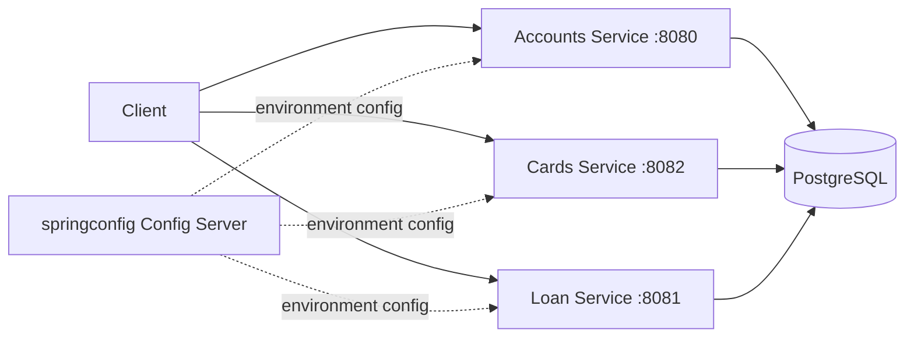

# Spring Boot Microservices - Banking Platform

A multi-module Spring Boot microservices project modeling a simplified bank: independent Accounts, Cards, and Loan services, each with its own database schema, REST API, and Swagger documentation, paired with a companion Spring Cloud Config Server (`springconfig`) for centralized, environment-specific configuration.

## Problem

A single monolithic banking application makes it hard to scale, deploy, or evolve individual capabilities like accounts, cards, and loans independently. This project splits those capabilities into separate Spring Boot services with their own persistence, validation, and error handling, while sharing common architectural patterns (layered packages, DTOs, global exception handling, auditing) so the services stay consistent with each other.

## Architecture



Each service follows the same layered structure: a Spring Data JPA entity extending a shared `BaseEntity`, a repository, a service interface with an implementation, a DTO layer for request and response shapes, and a REST controller documented with springdoc-OpenAPI annotations.

## Tech Stack

The services are built with Java 17 and Spring Boot 3.5.5, using Spring Data JPA with Hibernate against PostgreSQL, Jakarta Bean Validation for request validation, `springdoc-openapi-starter-webmvc-ui` for Swagger documentation, and Spring Boot's test starter for the generated test scaffolding. Configuration is externalized to environment variables and, at the platform level, to the companion Spring Cloud Config Server.

## How It Works

The **accounts** service is the most complete module: it has a full controller-service-repository stack, request and response DTOs, a `GlobalExceptionHandler` with a custom `CustomerAlreadyExistsException`, and JPA auditing wired through `AuditAwareImp` so created/updated metadata is tracked automatically. The **cards** service mirrors that same layered structure with its own entity, repository, service implementation, and controller. The **loan** service currently only has its application entry point and base entity scaffolded, and is the clear next module to build out following the same pattern as accounts and cards.

## Key Features

The project demonstrates a consistent layered architecture reused across independent services rather than copy-pasted ad hoc code, centralized exception handling that returns a structured `ErrorResponseDto` instead of raw stack traces, JPA auditing for created and modified metadata, and Swagger/OpenAPI documentation generated directly from controller annotations.

## API Flow

Each service exposes its own REST API on its own port (accounts on 8080, loan on 8081, cards on 8082). A request hits the controller, which delegates to a service interface implementation, which uses a Spring Data JPA repository to read or write PostgreSQL, with `GlobalExceptionHandler` translating any domain exception into a consistent `ErrorResponseDto` response. Each service also exposes interactive Swagger UI for exploring its endpoints directly.

## Setup

```bash
git clone https://github.com/yrlmanoharreddy/spring-boot-microservices-banking.git
cd spring-boot-microservices-banking/accounts
createdb intdb
export DB_USERNAME=postgres
export DB_PASSWORD=your-local-password
./mvnw spring-boot:run
```

Repeat with the `cards` and `loan` directories on their own ports. Database connection details are read from `DB_URL`, `DB_USERNAME`, and `DB_PASSWORD` environment variables rather than being hardcoded, so no real credentials need to live in source control.

## Testing

Each module includes the standard Spring Boot test scaffolding (`AccountsApplicationTests`, `CardsApplicationTests`, `LoanApplicationTests`) generated by Spring Initializr, but does not yet have meaningful unit or integration tests written against the controllers and services. Adding `@WebMvcTest` and `@DataJpaTest` coverage for the accounts and cards modules is the most valuable next step.

## Deployment

The services currently run as plain Spring Boot applications against a local PostgreSQL instance and are not yet containerized. Adding a `Dockerfile` per service and a `docker-compose.yml` that also runs PostgreSQL and the config server would be the natural next step toward a deployable, multi-container setup.

## Engineering Decisions

Splitting accounts, cards, and loan into separate Maven modules with their own `pom.xml`, rather than one shared module, was chosen so each service can be built, versioned, and eventually deployed independently, matching how real microservice teams operate. Centralizing exception handling per service through `GlobalExceptionHandler`, rather than letting exceptions bubble up as default Spring error pages, was a deliberate choice to keep API error responses consistent and machine-readable.

## Results

The accounts service is functionally complete end to end, from HTTP request to database and back, with validation, auditing, and documented error responses. The cards service reaches the same level of completeness. The loan service is intentionally left as a scaffold to make the repository's real state visible rather than implying functionality that does not exist yet.
